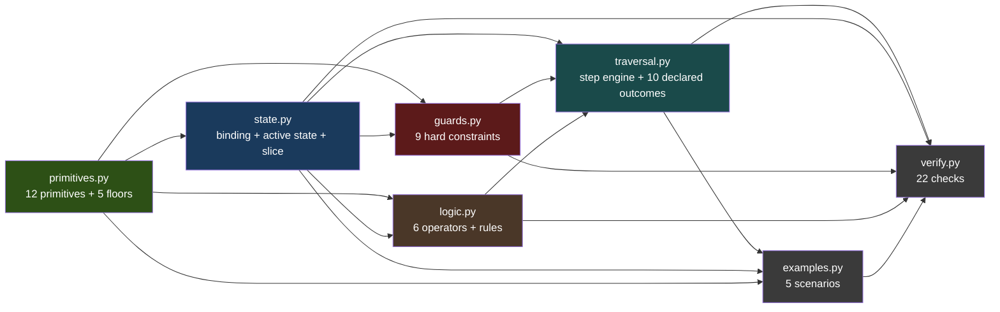
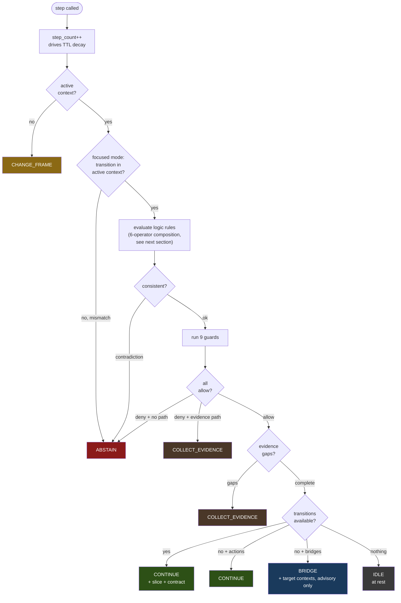
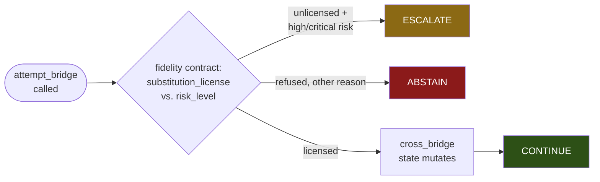
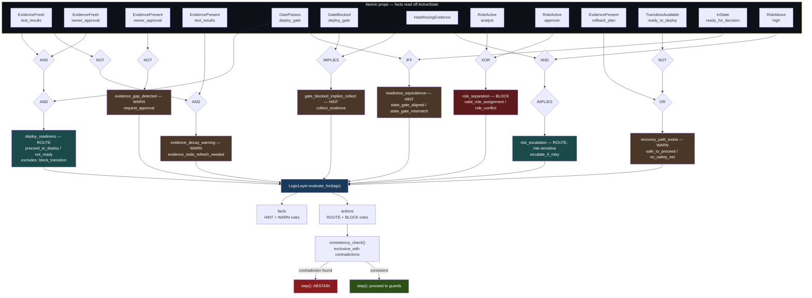
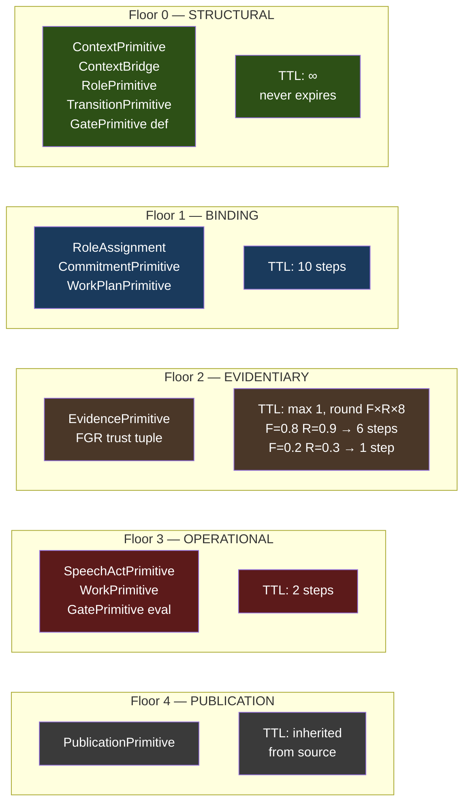
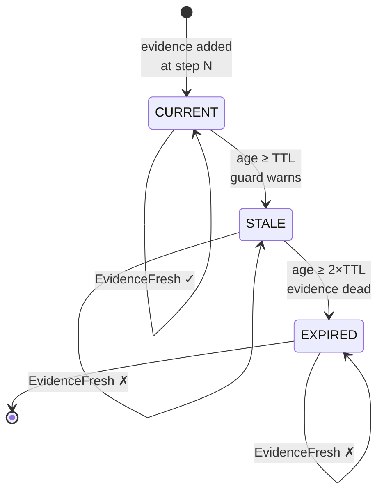
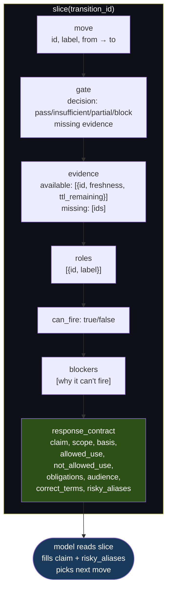
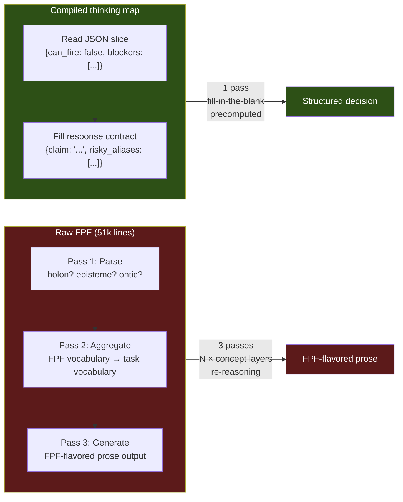
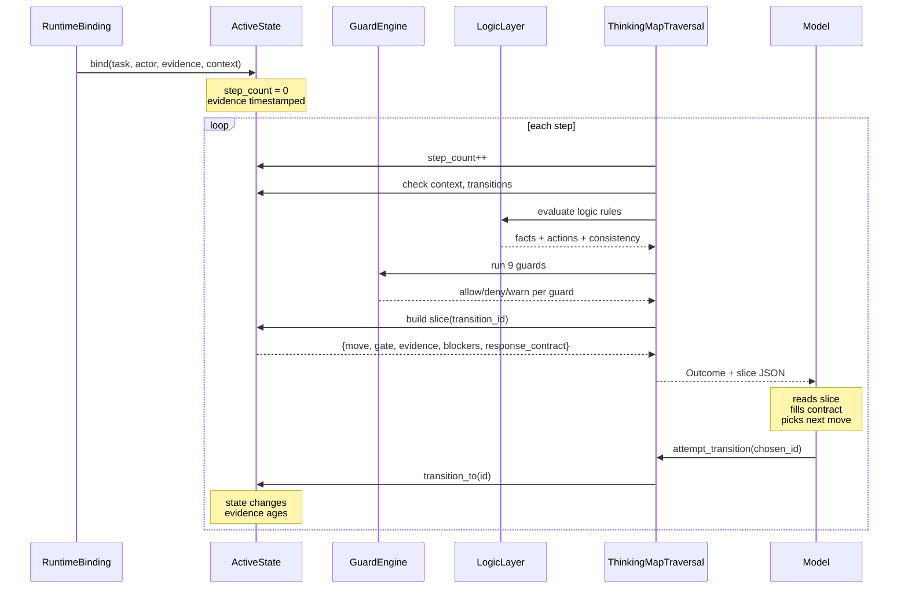

# Architecture

Visual scheme of the thinking map — how the pieces connect.

## Module dependency

## How a step works

`step()` is the focused, operational path — it can return 6 of the 10 declared outcomes. `ESCALATE` only comes from `attempt_bridge()` (below). `ASK`, `PUBLISH`, and `REVISE_PLAN` are declared in `OutcomeKind` and named in the module docstring, but no code path returns them yet — reserved, not implemented.

`step()` only *advertises* a bridge as available (`BRIDGE`, advisory metadata). Enacting one is a separate call:

`attempt_transition()` (enacting an advertised move) is narrower still: `ABSTAIN` (not found, wrong context, wrong state, gate blocks, guards deny), `COLLECT_EVIDENCE` (missing evidence or gate abstains), or `CONTINUE` (transitioned).

## Logic layer — how the 6 operators compose

Not one atom per rule — every rule in the shipped example (`examples.build_deploy_rules()`) fans multiple atomic facts through one or more operators before it becomes a `DecisionRule`. This is the real ruleset, not an illustration:

All 6 operators appear in real, currently-shipped rules — not one demo per operator in isolation, but genuine multi-atom compositions: `deploy_readiness` alone chains two `AND`s across three atoms before it's a rule. `risk_escalation` nests `AND` inside `IMPLIES`. `HasMissingEvidence` (`HG`) and `GatePasses` (`GD`) each feed two different rules — the same atom is reused across compound expressions, not one-to-one.

Two rule kinds don't reach `consistency_check()`: `HINT` and `WARN` rules land in `facts`, informational only. Only `ROUTE` and `BLOCK` rules land in `actions`, and only those are checked against each other's `exclusive_with` list. `deploy_readiness` (ROUTE) excludes `block_transition` — if some other active rule's action is literally the string `"block_transition"` while `deploy_readiness` is also satisfied, `consistency_check()` flags a contradiction and `step()` returns `ABSTAIN` before guards ever run.

## Semantic floors and TTL decay

## Evidence lifecycle

## The slice — what the model reads per move

`gate.decision` is the enum's `.value` string, not its name — `GateDecision.ABSTAIN` serializes as `"insufficient"`, `GateDecision.DEGRADE` as `"partial"`. The model reads the JSON string, never the Python name.

## The triple tax — raw FPF vs compiled

This diagram was a diagnosis, unmeasured, for over a year of this package's life. [`TRIPLE_TAX_CALCULUS.md`](docs/deep/TRIPLE_TAX_CALCULUS.md) measures the token/cost part strongly: real token counts on 5 shipped decision points put the compiled slice at a 4668.8x reduction against the raw spec's 2,247,567 tokens. One part of the diagram above genuinely wasn't confirmed, and one part is unconfirmable with a live model at all — both reported plainly rather than left implicit, same reason `SOURCES.md` says what it invented instead of staying silent. The 3-pass raw-FPF path was **never live-tested** — the raw spec is 2,247,567 tokens, past any practical context window, so only its token count was measured, not its actual reasoning behavior; the "3 passes" framing above is untested, not falsified. The live probe that *did* run on the compiled side did **not** return a stable pass structure either; self-reports were unstable and should not be treated as measured cognition phases. Separately, the shipped multi-step traversal measured linear accumulation over a 3-step example, not a strong superlinear compounding curve. The token-count advantage is real, large, and directly measured. The exact pass-by-pass mechanism remains an untested hypothesis and should stay proposal-soft unless new evidence improves it.

## Deploy scenario — full flow

## What's declared vs. what's reachable

The module docstring in `traversal.py` lists all 10 `OutcomeKind` values as if equally live. Checked against the actual code (via `run_scenario`/`run_verify`, not just reading), 7 are reachable and 3 are dead enum values with no producing code path:

| Outcome | Reachable from | Status |
|---|---|---|
| `CONTINUE` | `step()`, `attempt_transition()`, `attempt_bridge()` | live |
| `ABSTAIN` | `step()`, `attempt_transition()`, `attempt_bridge()` | live |
| `COLLECT_EVIDENCE` | `step()`, `attempt_transition()` | live |
| `CHANGE_FRAME` | `step()` | live |
| `IDLE` | `step()` | live |
| `BRIDGE` | `step()` | live (advisory only) |
| `ESCALATE` | `attempt_bridge()` | live |
| `ASK` | — | declared, unreachable |
| `PUBLISH` | — | declared, unreachable |
| `REVISE_PLAN` | — | declared, unreachable |

Not a bug — `PublicationPrimitive`/`WorkPlanPrimitive` exist and are floor-tagged, so the primitives these outcomes would attach to are already modeled; the traversal-side wiring to actually emit `PUBLISH` on a publish move or `REVISE_PLAN` on a plan-revision move just isn't built yet. Recorded here instead of left implicit, same reason `SOURCES.md` now says what it invented instead of staying silent about it.

---

**prichindel.com** — v1.4.25
