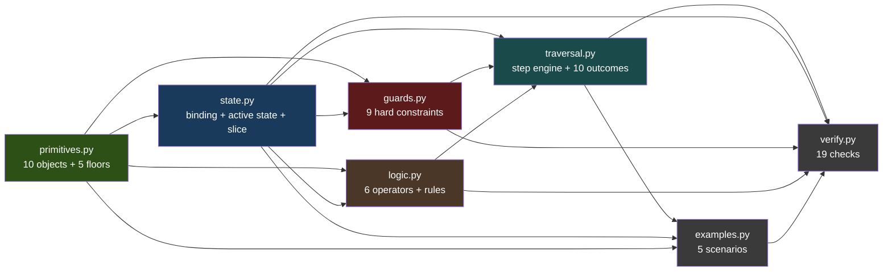
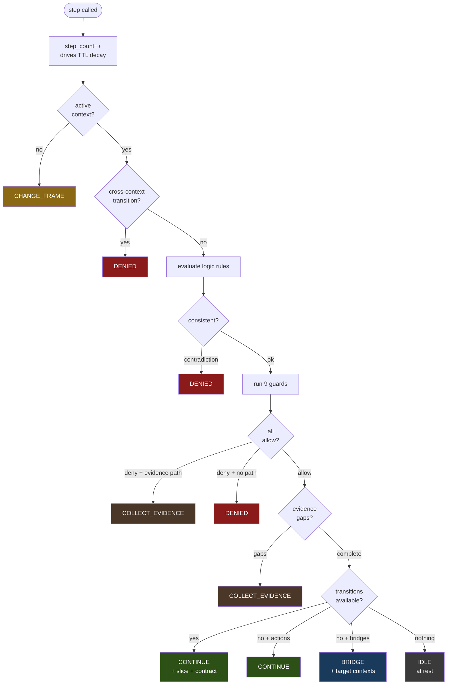
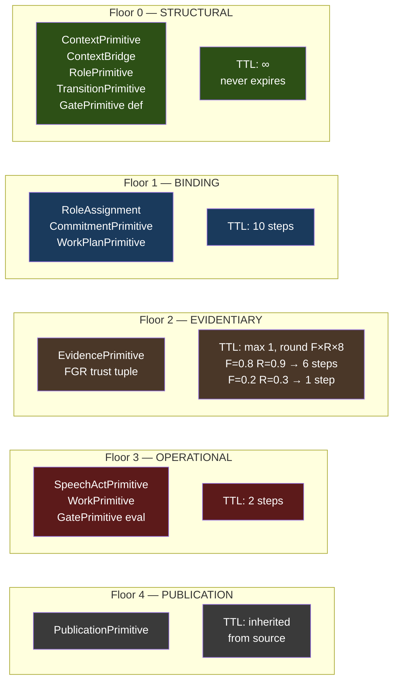
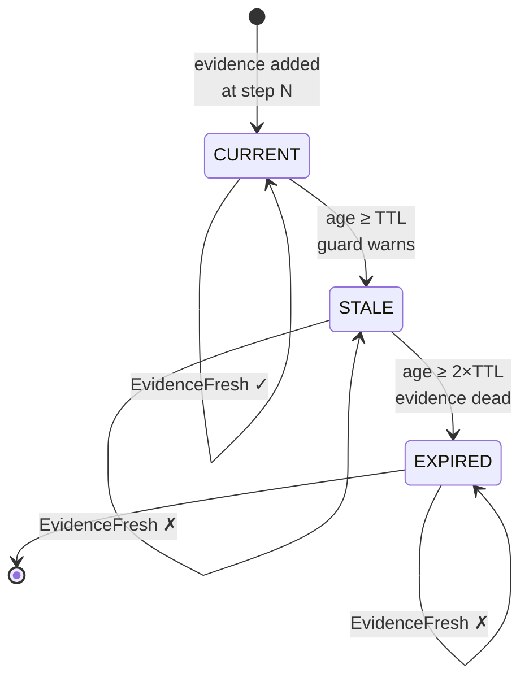
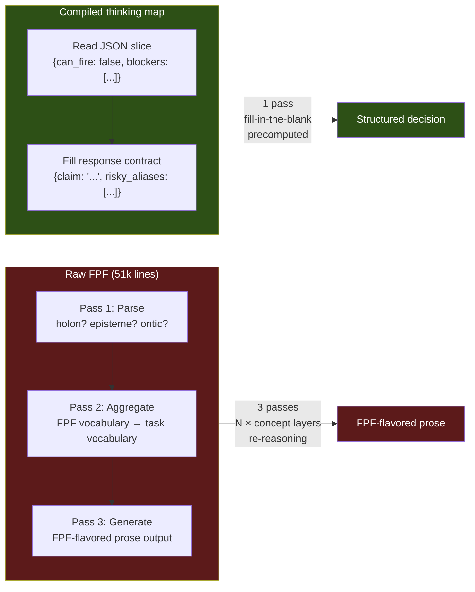
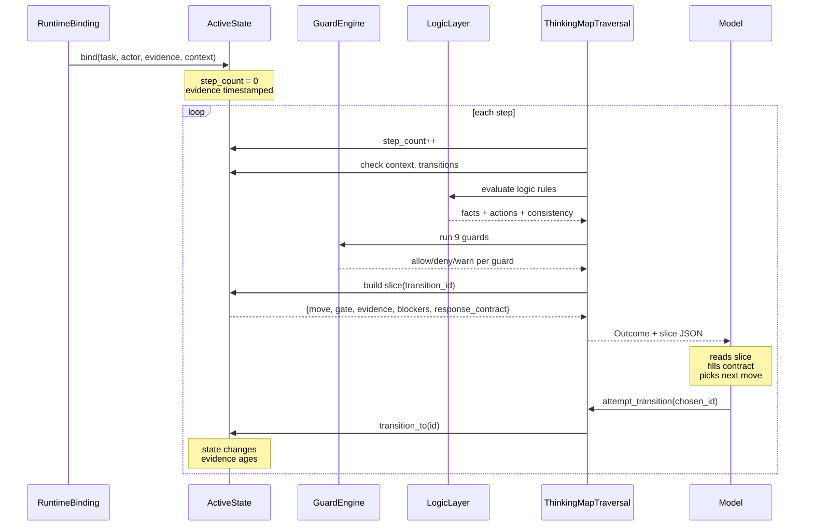

# Architecture

Visual scheme of the thinking map — how the pieces connect.

## Module dependency

## How a step works

## Semantic floors and TTL decay

## Evidence lifecycle

## The slice — what the model reads per move

## The triple tax — raw FPF vs compiled

## Deploy scenario — full flow

---

**prichindel.com** — v1.1.3
