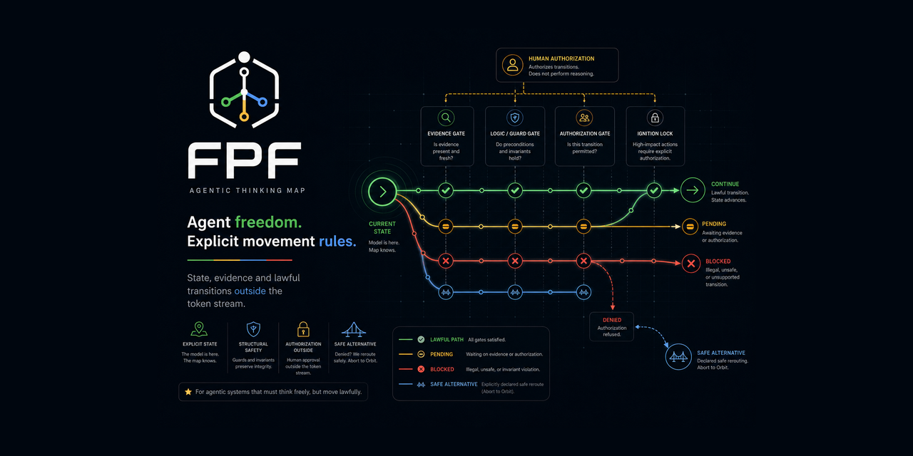

<p align="center">
  
</p>

# FPF Agentic Thinking Map

**FPF Agentic Thinking Map** is a zero-dependency Python runtime for controlling
multi-step agent traversal through explicit states, evidence gates, lawful
transitions, and inspectable outcomes.

Use it when an agent must know where it is, what it may do next, what
evidence is missing, and when human authorization is required.

For agentic systems that must think freely, but move lawfully.

**v1.8.0** · Python 3.12+ · MIT · zero runtime dependencies

[](https://pypi.org/project/fpf-thinking-map/)
[](https://pypi.org/project/fpf-thinking-map/)
[](LICENSE)
[](pyproject.toml)
[](fpf_thinking_map/verify.py)
[](https://igareosh.github.io/fpf-agentic-thinking-map/demos/)
[-3.7k-1f6feb)](https://pypistats.org/packages/fpf-thinking-map)

---

## Install and 60-second example

```bash
pip install fpf-thinking-map
python -m fpf_thinking_map.verify     # 25/25 checks against your install
python -m fpf_thinking_map.examples   # runnable walkthroughs, incl. Ignition Lock
```

```python
from fpf_thinking_map import (
    SemanticMap, ContextPrimitive, RolePrimitive,
    TransitionPrimitive, GatePrimitive, GateCheck,
    RuntimeBinding, ThinkingMapTraversal,
)

sm = SemanticMap()
sm.register_context(ContextPrimitive("deploy", "Deploy Context"))
sm.register_role(RolePrimitive("owner", "Owner", "deploy"))
sm.register_gate(GatePrimitive(
    "release_gate", "Release Gate", "deploy",
    checks=[GateCheck("tests", "Green tests", required_evidence=["test_results"])],
))
sm.register_transition(TransitionPrimitive(
    "ship", "Ship release", "deploy", "candidate", "released",
    required_evidence=["test_results"],
))

engine = ThinkingMapTraversal(sm)
state = engine.build_active_state(
    RuntimeBinding(task="release", actor_role_ids=["owner"],
                    active_context_id="deploy", current_evidence=["test_results"]),
    current_state="candidate",
)
print(engine.step(state).kind)  # CONTINUE / COLLECT_EVIDENCE / BRIDGE / IDLE / ESCALATE
```

`candidate` → gate checks pass on `test_results` → `ship` fires → `released`.
The engine is domain-agnostic: you define your own contexts, evidence,
gates, and transitions. More runnable walkthroughs, including the
human-authorization path below, live in
[`fpf_thinking_map/examples.py`](fpf_thinking_map/examples.py) — run them all with
`python -m fpf_thinking_map.examples`.

---

## What problem it solves

In long multi-step agent runs, models waste budget on self-management:
re-checking what was already checked, re-deriving state from prior prose,
re-arguing about their own prior reasoning. That's where drift and context
noise come from.

This package moves traversal bookkeeping — context, roles, transitions,
evidence freshness, guards, outcome kind — out of the token stream and into
code, so the model spends capacity on the task instead of on tracking where
it is.

---

## Runtime flow

```
Application / Agent
        │
        ▼
   RuntimeBinding
        │
        ▼
    ActiveState
        │
        ├── evidence freshness
        ├── gate checks
        ├── transition legality
        └── authorization
        │
        ▼
      Outcome
CONTINUE | COLLECT_EVIDENCE | BRIDGE | IDLE | ESCALATE
```

Each `step()` returns a compact JSON slice: where the agent is, what can
fire, what's blocked, what evidence is missing or stale, and which outcome
applies. The map constrains traversal legality — it does not overwrite user
meaning and does not replace model intelligence.

---

## Core capabilities

- **Explicit state** — contexts, roles, and the active state are first-class objects, not prose the model has to re-derive each turn.
- **Evidence gates** — transitions declare `required_evidence`; the engine checks freshness before it lets a move fire.
- **Lawful transitions, enforced in code** — most agent setups handle this with a system prompt or a rules file: tokens sitting in context, waiting to be deprioritized or reinterpreted as the conversation grows. Here, legality of the next move is computed by `GatePrimitive` / `TransitionPrimitive` outside the token stream, so it can't be silently reinterpreted the way prose instructions can.
- **Inspectable outcomes** — every step resolves to one of five outcome kinds, not free text.

---

## Ignition Lock & Abort to Orbit — HITL gating with a reroute on denial

`requires_human_authorization` lets a transition be fully legal by every
FPF-computed measure (evidence fresh, gate satisfied) and still refuse to
fire without a caller passing `authorized=True`. `safe_alternatives` +
`ActiveState.deny_pending_authorization(...)` mean a denial reroutes to a
declared non-destructive twin instead of dead-ending. Motivated by
destructive/irreversible moves, but the primitives are general — a map
author can gate on cost, scope, or anything else that needs a second
party's say-so.

`authorized=True` is an ambient boolean — it proves *a* human said yes, not
that they said yes to *this* state. `fpf_thinking_map.authorization.AuthorizationReceipt`
scopes the yes to one `transition_id` and a hash of the exact state it was
issued against (`issue_authorization_receipt(state, transition_id, request_id)`);
`attempt_transition(..., authorization=receipt)` rejects it if the transition,
state, expiry, or prior consumption don't check out — closing the
inspect-one-state / fire-into-another gap that a bare boolean can't see.
`authorized=True` still works for callers who haven't migrated.

- [`ADOPTED_IGNITION_LOCK.md`](docs/deep/ADOPTED_IGNITION_LOCK.md) — what shipped, why, how it was tested
- [`ADVISORIES.md`](docs/deep/ADVISORIES.md) — `ADV-08` (no persistence surface), `ADV-10` (ungated-by-default lint), `ADV-11` (unsound `safe_alternatives` lint)
- [`run_scenario_destructive_hitl` / `run_scenario_denied_reroute`](fpf_thinking_map/examples.py) — runnable walkthroughs
- [`dev_mcp`](dev_mcp/README.md) — test your own map's use of this against the live engine

---

## AWAIT — waiting on something outside the map, distinct from being done

`IDLE` used to mean two different things: "done, nothing left to do" and
"nothing to do *right now*, but something external is still owed" — the
same conflation `pending_authorizations` already fixed for human decisions
(see `ADV-08`), applied here to external dependencies instead.

`fpf_thinking_map.pending_input.PendingInput` declares one such dependency —
a worker result, a human reply, anything the map itself doesn't produce —
with declared `wake_conditions` describing what would resolve it. When
nothing else is actionable and an unresolved `PendingInput` exists,
`step()` returns `AWAIT` (carrying `pending_input_ids` and
`wake_conditions`) instead of `IDLE`. A candidate action or a context
bridge elsewhere still wins over `AWAIT` — waiting never hides an
available move. The map never polls, schedules, or resolves the
dependency; the host owns that lifecycle and sets `PendingInput.status`
itself.

Maps that never declare `pending_inputs` see no change — `AWAIT` never
fires and `IDLE`'s behavior is exactly what it was before.

- [`check_pending_input_await`](fpf_thinking_map/verify.py) — regression, ordering (`CONTINUE`/`BRIDGE` still win over `AWAIT`), and projection coverage
- [Why runtime affordance projection was rejected alongside this →](docs/deep/REJECTED_RUNTIME_AFFORDANCE_PROJECTION.md)

---

## Measurements

Tested on **5 shipped decision points**:

- compiled `state.slice()` averaged **481.4 tokens per decision**
- raw FPF exact-section prompt averaged **138977.2 tokens per decision**
- that is **288.7x smaller per decision** (259.0x on live billed input tokens: 537.4 vs 139194.6)

This measures traversal-context size for these five decision points —
compiled runtime state versus injecting the equivalent raw FPF source
sections — not general model intelligence or total application cost. Full
methodology: [TRIPLE_TAX_CALCULUS.md](docs/deep/TRIPLE_TAX_CALCULUS.md).

---

## Architecture and repository components

- [Visual architecture →](ARCHITECTURE.md) (core engine)
- [dev_mcp visual architecture →](dev_mcp/ARCHITECTURE.md) (MCP tool layer, testing mode)

| Path | What it is |
|---|---|
| `fpf_thinking_map/` | Published runtime library — what PyPI ships |
| `dev_mcp/` | Development and compliance-testing harness, not shipped, own test suite ([38/38 pass](dev_mcp/test_server.py)), own [11 integrator advisories](docs/deep/ADVISORIES.md) — kept distinct on purpose rather than folded into core numbers above |
| `docs/` | Architecture, experiments, decisions, and adversarial studies |

- [Release history →](https://github.com/igareosh/fpf-agentic-thinking-map/releases)
- [Deep decisions/rejections/adoptions →](docs/DECISIONS_REJECTIONS_ADOPTIONS.md)
- [Related projects we've reviewed →](docs/RELATED_PROJECTS.md) (not used by us, not a partnership — just noted so we don't forget)
- [Live demo →](https://igareosh.github.io/fpf-agentic-thinking-map/demos/)

---

## Relationship to FPF

Based on [ailev/FPF](https://github.com/ailev/FPF) by Anatoly Levenchuk.
Acknowledged as inspiration and source material, not as a scope lock.

This package is an independent implementation, MIT-licensed, and open to
reuse in other developments. It keeps its own runtime scope and, where
needed to preserve that scope, omits or explicitly rejects parts of FPF
rather than inheriting the framework as an inseparable whole.

FPF is the broad frame. This package is the compact runtime traversal tool.

---

## Scope and non-goals

It is for:

- bounded, stepwise agent traversal
- clearer failure signals
- lower runtime noise
- inspectable behavior
- Ignition Lock — HITL gating on destructive/irreversible transitions, with declared non-destructive alternatives so a denial routes somewhere instead of dead-ending

It is not:

- full semantic ingestion of FPF
- a universal reasoning engine
- a replacement for application logic
- an in-engine memory/retrieval system (no embeddings/vector store inside this engine)

Compatibility: works with model families that can read structured JSON and
follow constraints. No model-specific prompt protocol is required by the
engine itself.

Design principles: add structure only when behavior improves; keep
per-step payload small; keep legality checks explicit; keep model
generation free; optimize for inspectability.

---

## Documentation, provenance, attribution, and licence

- [Decisions, rejections, adoptions index](docs/DECISIONS_REJECTIONS_ADOPTIONS.md) — theory, adoption/rejection rationale, analysis provenance
- Testing this package's behavior against the documented [integrator advisories](docs/deep/ADVISORIES.md) (evidence staleness, risk-level filtering, bridge trust, and the rest)? [`dev_mcp`](dev_mcp/README.md) checks scenario runs against all 8 automatically and keeps a log of what fired — useful if you're integrating this into your own agent and want to know which sharp edges your scenarios actually touched, not just which ones exist on paper.
- Repository-wide SHA-256 fingerprints in [SHA256SUMS](SHA256SUMS) give a simple integrity proof for the tracked source state that ships with this repository.

**Maintained by:** igareosh.com · **Contact:** igareosh@igareosh.com · **GitHub / Telegram:** @igareosh
**Inspiration acknowledged:** Anatoly Levenchuk / `ailev/FPF`

Plain-language attribution and scope boundaries live in [NOTICE](NOTICE).

**License:** MIT. See [LICENSE](LICENSE). For ownership, attribution, and scope notes, see [NOTICE](NOTICE).

Published as a small community implementation: free to use, open to
inspect, and meant to be a practical point of discussion rather than a
total framework.

---

*"Pick something. Get good at it. See if you can be the best at it."* — Jordan Peterson

*"All speech is vain and empty unless it be accompanied by action."* — Demosthenes
