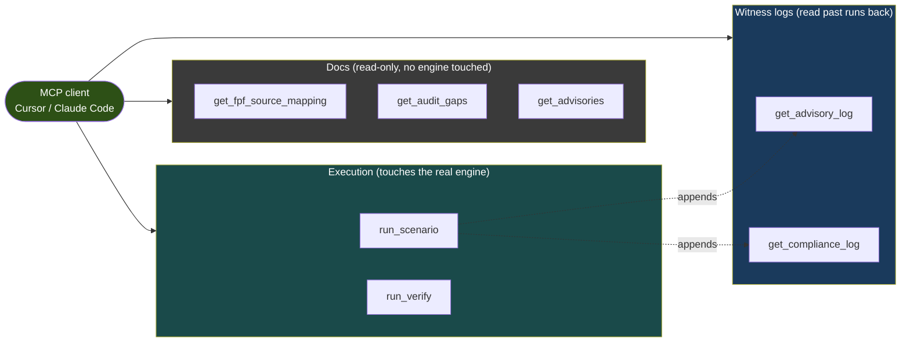
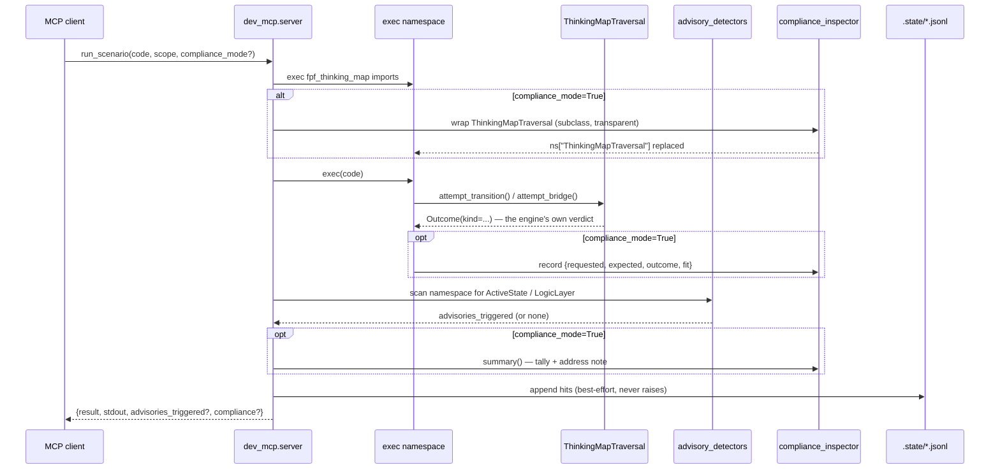
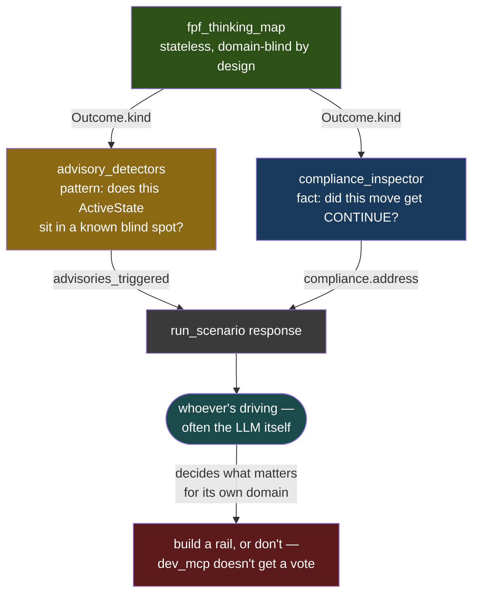

# dev_mcp — visual architecture

Companion to the top-level [`ARCHITECTURE.md`](../ARCHITECTURE.md), scoped to the MCP
layer only — `dev_mcp` never appears in that diagram because it isn't shipped in the
PyPI package. This is what wraps the engine for agentic testing, not the engine itself.

## Tool surface

Seven tools, three jobs: read the docs, run code against the real engine, read back
what was durably logged from past runs.

## `run_scenario` request lifecycle

Both awareness layers — advisory detection and compliance mode — are optional,
independent, and non-blocking. Neither can stop `exec(code)` from doing whatever it
does; they only get to look at what already happened, after it happened.

## Two witnesses, one engine — why neither one drives

The shape that makes `ADV-09` true isn't an accident of this diagram — it's the point
of it. Both witnesses sit *beside* the engine, read what it already decided, and hand
that back to whoever's calling. Neither one sits *in front of* it.

